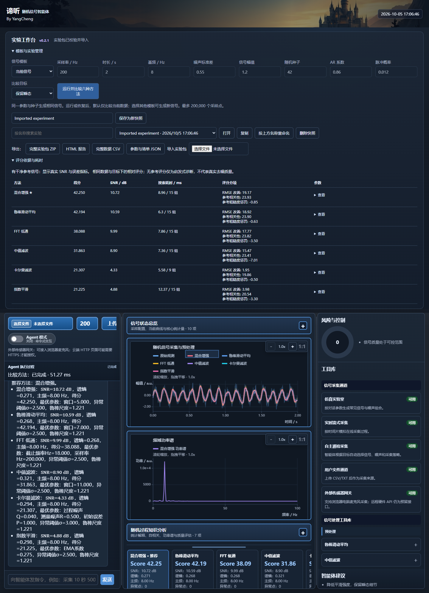
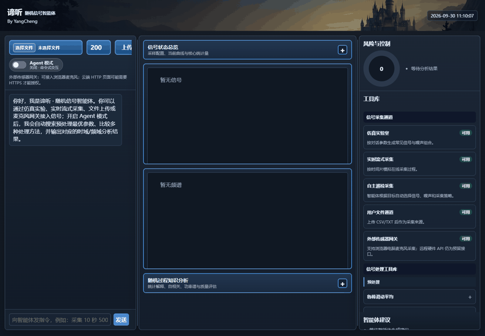
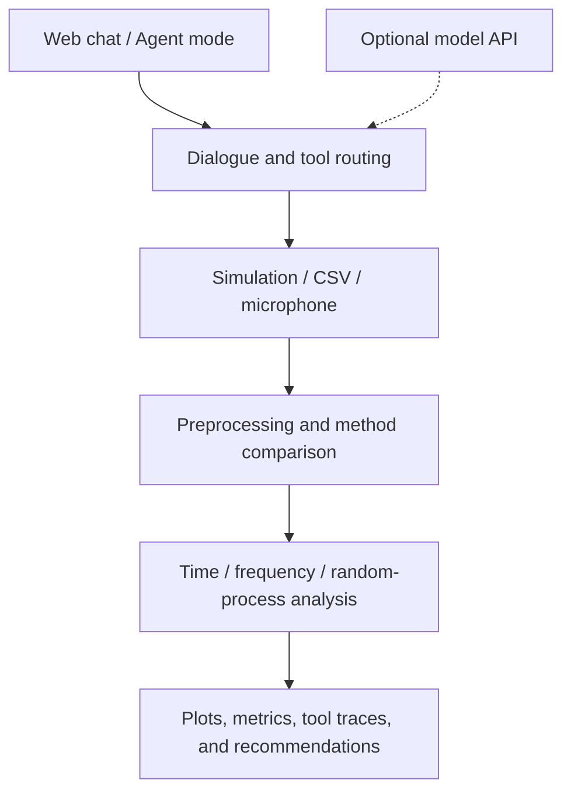

<div align="center">

# 🌊 Random Signal Agent · 谛听

[](https://github.com/PatrickStar-cmd/random-signal-agent/releases/latest)
[](RELEASE.md)
[](https://github.com/PatrickStar-cmd/random-signal-agent/actions/workflows/validate-deployment.yml)
[](LICENSE)

</div>

<div align="left">

[简体中文](README.md) · **English**

**Signal simulation, filtering, and analysis — through conversation.**

Diting turns Random Signals coursework into reproducible experiments. Generate a noisy signal, compare filters, inspect its time and frequency features, and follow each tool call in one Web interface.

Built for the Random Signals course at **UESTC**. The local toolchain works without a model API key; an optional Chat Completions-compatible service adds model-assisted dialogue.

[🌐 Experiment preview](https://patrickstar-cmd.github.io/random-signal-agent/) · [📦 Download v0.2.1](https://github.com/PatrickStar-cmd/random-signal-agent/releases/tag/v0.2.1) · [📘 Installation guide](RELEASE.md)

## 🧭 Explore

| Get started | Learn more |
| --- | --- |
| [✨ Features](#en-features) | [🏗️ How it works](#en-workflow) |
| [🎬 Interface](#en-interface) | [⚙️ Configuration](#en-configuration) |
| [🚀 Quick start](#en-quick-start) | [📊 Example results](#en-results) |
| [🧪 First experiment](#en-first-experiment) | [🔧 Troubleshooting](#en-troubleshooting) |
| [📚 Documentation](#en-documentation) | [🤝 Contributing](#en-contributing) |

<a id="en-features"></a>

## ✨ Features

| Capability | What you can do |
| --- | --- |
| 💾 Experiment workbench | Create from templates, save, reopen, duplicate, search, rename or delete snapshots, and resume after a restart. |
| 📦 Data and reports | Export full-resolution CSV, standalone HTML reports, manifests and portable experiment ZIPs. |
| 🧮 Explainable comparison | Choose denoising, waveform or transient preservation; inspect score terms, parameters and timings. |
| 🎲 Reproducible simulation | Set sample rate, duration, frequency, noise, and random seed. |
| 🧹 Six preprocessing methods | Compare robust moving average, median, exponential smoothing, FFT low-pass, hybrid, and Kalman filtering. |
| 📈 Time and frequency analysis | Inspect statistics, FFT peaks, correlations, and spectral features. |
| 🔬 Random-process analysis | Explore AR models, Welch power spectra, and residuals. |
| 🤖 Agent mode | Compare methods and parameters automatically, inspect tool traces, and review recommendations. |
| 🎙️ Multiple inputs | Analyze simulated signals, CSV/TXT samples, or browser microphone audio; download processed audio. |

<a id="en-interface"></a>

## 🎬 Interface



<details>
<summary><strong>Watch an Agent mode experiment</strong></summary>

Enable **Agent mode**, enter an acquisition command, and follow the preprocessing comparisons and analysis results.



</details>

<a id="en-quick-start"></a>

## 🚀 Quick start

Use **Python 3.12–3.14** or **Docker Compose v2**. v0.2.1 uses FastAPI; deployment checks cover Python 3.12–3.14 on Windows and Linux, plus Docker on Linux.

### 1. Get the project

Download the v0.2.1 [deployment ZIP](https://github.com/PatrickStar-cmd/random-signal-agent/releases/download/v0.2.1/random-signal-agent-v0.2.1-deploy.zip) and extract it, then open a terminal in `工程文件/代码` inside the extracted folder.

Or clone the repository:

```bash
git clone https://github.com/PatrickStar-cmd/random-signal-agent.git
cd "random-signal-agent/工程文件/代码"
```

### 2. Install and start

**Windows PowerShell** — use a Python 3.12 installation:

```powershell
python -m venv .venv
.\.venv\Scripts\python.exe -m pip install -r requirements-repro.txt
.\.venv\Scripts\python.exe server.py --host 127.0.0.1 --port 8000
```

**Linux / macOS**

```bash
python3.12 -m venv .venv
.venv/bin/python -m pip install -r requirements-repro.txt
.venv/bin/python server.py --host 127.0.0.1 --port 8000
```

<details>
<summary><strong>Run with Docker instead</strong></summary>

From the same `工程文件/代码` directory:

```bash
cp .env.example .env
docker compose up -d --build --wait --wait-timeout 120
```

On Windows, replace the first command with `Copy-Item .env.example .env`. Uploads and generated outputs persist in local folders. Use `docker compose logs --tail 100` to inspect the service and `docker compose down` to stop it.

</details>

### 3. Open the application

Visit **<http://127.0.0.1:8000>**. Simulation, filtering, and analysis are available without configuring an external model.

The [online preview](https://patrickstar-cmd.github.io/random-signal-agent/) shows the saved experiment and interface captures. Interactive experiments run with the Python backend.

<a id="en-first-experiment"></a>

## 🧪 Your first experiment

Choose a template and comparison goal in the workbench, then run the six methods. Name and save a snapshot, or export an experiment ZIP to restore full samples, results and tool records later. Successful operations automatically save the current experiment. After running or restoring, comparisons reuse the current data; select a different template to generate a new signal. Search snapshots by name, rename a selected snapshot using the name field, or delete it after confirmation. Deletion preserves the current workspace and other snapshots.


1. Enter this acquisition command in the chat. The example uses Chinese, as supported by the local command parser:

   > 采集一段 8 秒、采样率 200Hz、主频 8Hz 的正弦信号加高斯噪声，随机种子 42

   This creates an 8-second sine signal with Gaussian noise at 200 Hz, with an 8 Hz target frequency and seed 42.

2. Ask for preprocessing and analysis:

   > 使用滑动平均预处理并分析时域和频域特征

3. Inspect the curves and metrics. Enable **Agent mode** before acquisition to compare preprocessing methods automatically.

Keep the same parameters and random seed to reproduce the same simulated samples. For file inputs, use a single column of sample values or two columns of time and values; see the [data guide](docs/README.en.md).

<a id="en-workflow"></a>

## 🏗️ How it works



| Component | Responsibility |
| --- | --- |
| `web/chat.html` + `server.py` | Web interface, uploads, HTTP endpoints, and streamed responses. |
| `src/dialogue_agent.py` | Interpret tasks and coordinate the signal tools. |
| `src/acquisition.py` | Acquire simulated signals, uploaded samples, and audio. |
| `src/preprocessing.py` | Filter signals and compare candidate methods. |
| `src/analysis.py` + `src/advanced_analysis.py` | Calculate time, frequency, and random-process features. |
| `src/llm_client.py` | Connect to an optional Chat Completions-compatible service. |

All component paths are relative to `工程文件/代码`.

<a id="en-configuration"></a>

## ⚙️ Configuration

The quick-start commands use the local toolchain. To connect an external model, copy `config/server.env.example` to `config/server.env` and fill in your endpoint, model, and key.

| Setting | Purpose |
| --- | --- |
| `RS_AGENT_HOST` / `RS_AGENT_PORT` | Server bind address and port; use `127.0.0.1` for local access. |
| `RS_AGENT_LLM_BASE_URL` | Model API base URL, such as `https://your-provider.example.com/v1`. |
| `RS_AGENT_LLM_MODEL` | Model identifier accepted by your provider. |
| `RS_AGENT_LLM_API_KEY` | Your provider's API key. |
| `RS_AGENT_LLM_TIMEOUT` | Model request timeout in seconds; default: `45`. |
| `RS_AGENT_LOG_FILE` | Startup-script log path; default: `logs/server/server.log`. |

After activating the virtual environment, use `scripts/start_server.ps1` on Windows or `bash scripts/start_server.sh` on Linux/macOS to load this file. Directly running `server.py` does not load `config/server.env`.

Docker Compose reads `.env` in the code directory. See the [deployment guide](工程文件/代码/DEPLOY.md) for Docker settings, HTTPS hosting, and service management.

<a id="en-results"></a>

## 📊 Reproducible example

The saved showcase uses a random process with mixed noise: **200 Hz**, **8 seconds**, **1,600 samples**, an **8 Hz** target frequency, and **seed 42**. A robust moving average uses a 7-sample window.

| Metric | Result |
| --- | ---: |
| Detected dominant frequency | 8.000 Hz |
| Original SNR | 2.859 dB |
| Processed SNR | 4.781 dB |
| SNR improvement | 1.922 dB |

Results depend on the input signal and filter parameters.

[Sample CSV](docs/data/sample.csv) · [Analysis results](docs/data/result.json) · [Experiment configuration](工程文件/代码/config/showcase.json) · [Reproduction guide](docs/README.en.md)

<details>
<summary><strong>Check your deployment</strong></summary>

With the application running, open another terminal in `工程文件/代码` and use the same Python environment:

```powershell
# Windows
.\.venv\Scripts\python.exe scripts/smoke_deployment.py --base-url http://127.0.0.1:8000
```

```bash
# Linux / macOS
.venv/bin/python scripts/smoke_deployment.py --base-url http://127.0.0.1:8000
```

The check covers health, Web assets, Agent mode, streaming, CSV upload, and synthetic audio download. Its result is written to `logs/deployment/latest.log`. Release assets also include `SHA256SUMS.txt` and `verification.json`.

</details>

<a id="en-troubleshooting"></a>

## 🔧 Troubleshooting

| Question | Answer |
| --- | --- |
| Why does the online preview not run new experiments? | GitHub Pages serves the saved showcase. Start the backend locally or deploy it with Docker for interactive use. |
| Do I need an API key? | The local signal tools do not require one. Model-assisted dialogue is optional. |
| Which Python versions work? | v0.2.1 supports 3.12–3.14 and removes `cgi`. The older v0.1.0 package still requires Python 3.12. |
| Why can I not activate the virtual environment on Windows? | The quick-start commands call `.venv\Scripts\python.exe` directly and do not require activation. |
| Why is the microphone unavailable? | Open the app on localhost or HTTPS and allow microphone access in the browser. |
| Why does my uploaded signal have no SNR value? | Reference-based SNR requires a clean signal. Uploaded samples and microphone audio do not provide that reference. |
| What if port 8000 is occupied? | Start with `--port 8001`, then open `http://127.0.0.1:8001`; update the smoke-check URL too. |

<a id="en-documentation"></a>

## 📚 Documentation

| Guide | Contents |
| --- | --- |
| [Installation & release](RELEASE.md) | Deployment ZIP, platform commands, and checksums. |
| [Experiment guide](docs/README.en.md) | Saved data, parameters, file formats, and reproduction. |
| [Code overview](工程文件/代码/README.md) | Modules and model configuration. |
| [Running & configuration](工程文件/代码/docs/exec.md) | Commands, settings, and logs. |
| [Features & validation](工程文件/代码/docs/review.md) | Implemented capabilities, checks, and current limits. |
| [Algorithm principles](工程文件/代码/docs/principle.md) | Signal-processing methods and analysis. |
| [Deployment](工程文件/代码/DEPLOY.md) | Docker, HTTPS, systemd, and health checks. |
| [Changelog](CHANGELOG.md) | Release history. |

The code and algorithm guides are in Chinese. The [original PDF setup guide](工程文件/配置文档/随机信号智能体配置教程.pdf) is also included.

<a id="en-contributing"></a>

## 🤝 Contributing

Issues and pull requests are welcome for bug fixes, signal-processing methods, experiment examples, and documentation. For a bug report, include your Python version, input parameters, steps to reproduce, and relevant logs. For an algorithm change, include a reproducible signal and a before/after comparison.

[Open an issue](https://github.com/PatrickStar-cmd/random-signal-agent/issues) · [View pull requests](https://github.com/PatrickStar-cmd/random-signal-agent/pulls)

## 📄 License

Licensed under the [MIT License](LICENSE). Retain the license and copyright notice when using, modifying, or distributing the project. Third-party dependencies and assets retain their respective licenses.

</div>
