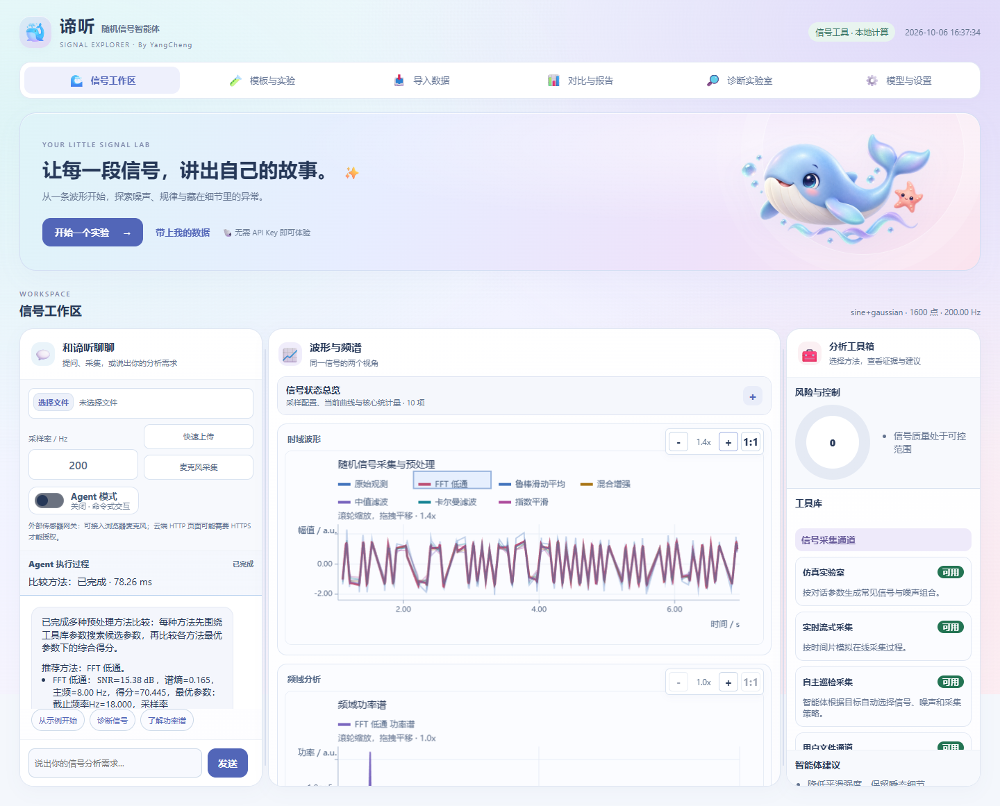
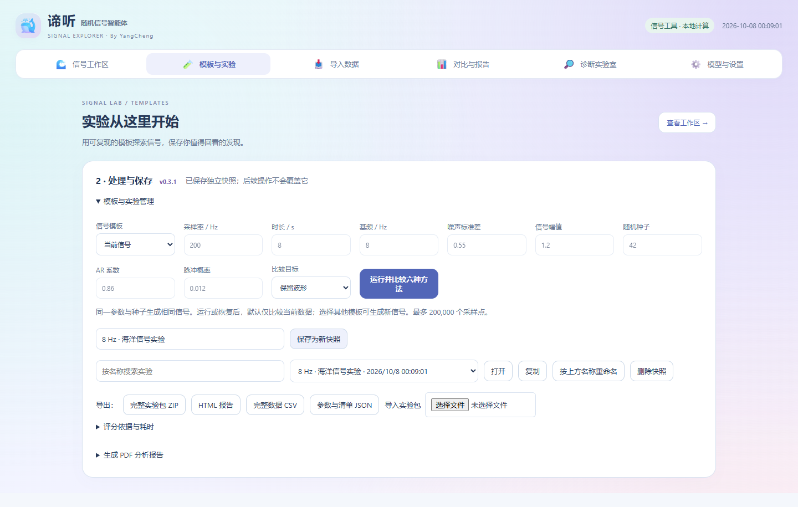
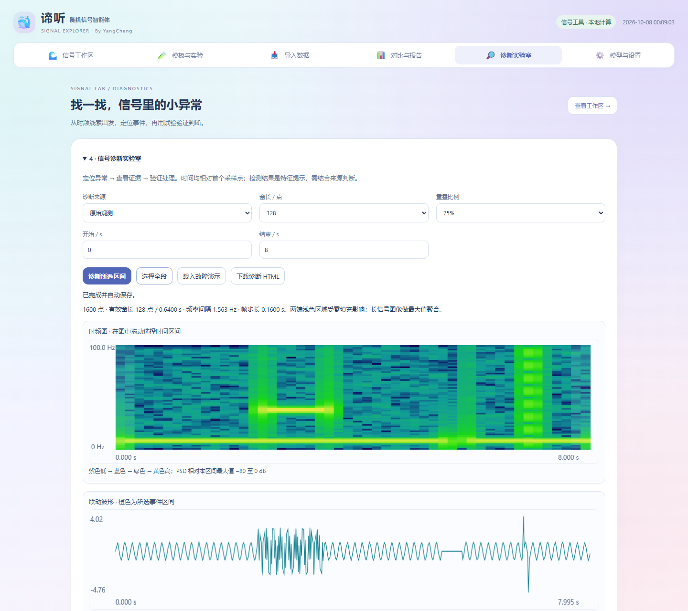
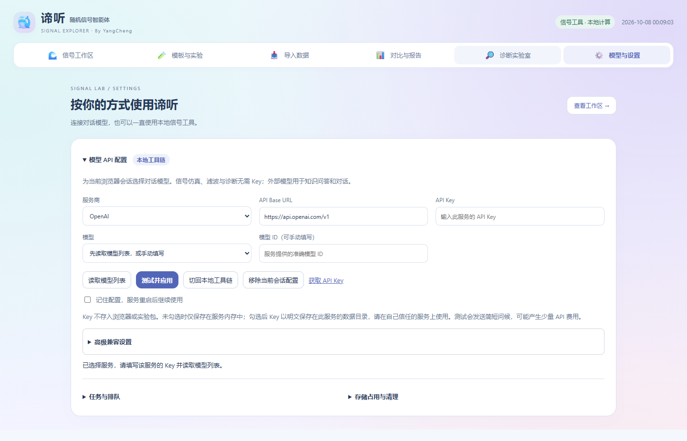
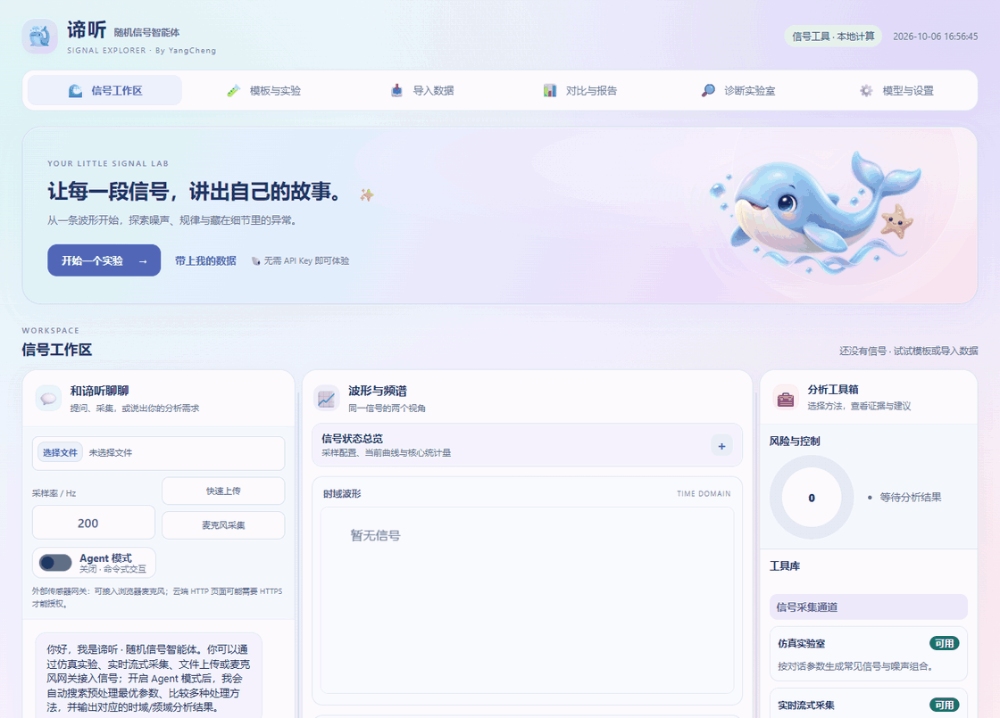
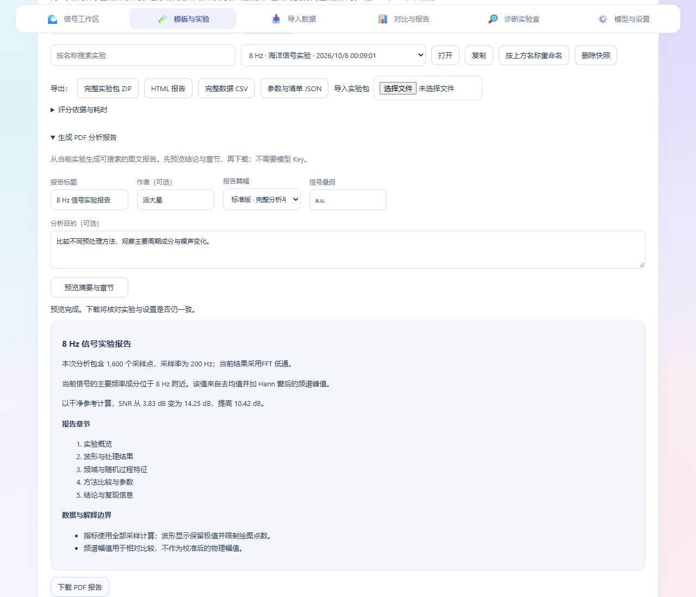
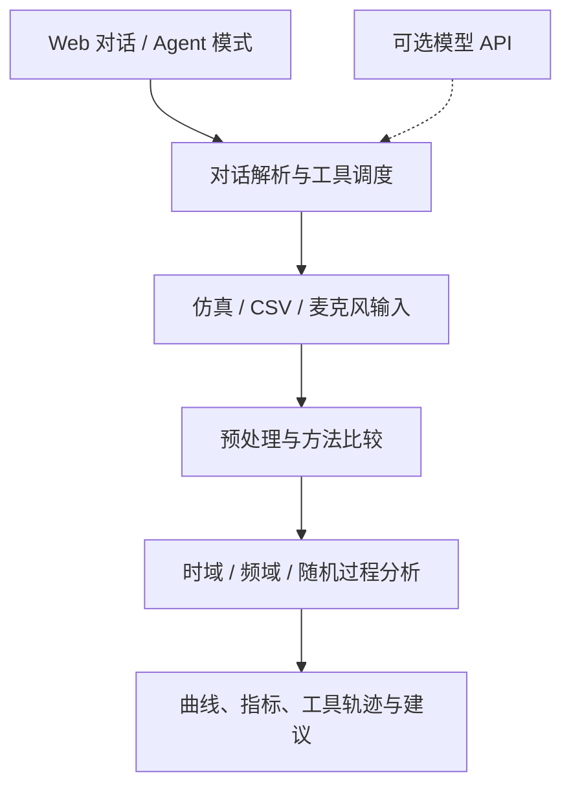
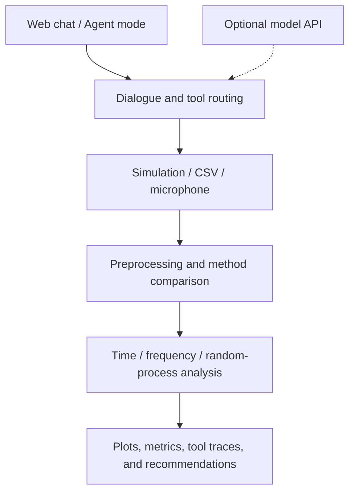

<div align="center">

# 🌊 Random Signal Agent · 谛听

[](https://github.com/PatrickStar-cmd/random-signal-agent/releases/latest)
[](RELEASE.md)
[](https://github.com/PatrickStar-cmd/random-signal-agent/actions/workflows/validate-deployment.yml)
[](LICENSE)

</div>

<details name="readme-language">
<summary><strong>简体中文</strong></summary>

<div align="justify">

**通过对话完成信号仿真、滤波与分析。**

谛听将随机信号课程中的实验串联成可复现的分析流程：生成带噪信号、比较滤波方法、查看时频特征，并在同一个 Web 界面中追踪工具调用。

项目面向 **UESTC 随机信号课程**。本地工具链无需模型 API Key 即可运行，也可接入兼容 Chat Completions 的服务，增强对话能力。

[🌐 实验预览](https://patrickstar-cmd.github.io/random-signal-agent/) · [📦 下载 v0.3.1](https://github.com/PatrickStar-cmd/random-signal-agent/releases/tag/v0.3.1) · [📘 安装指南](RELEASE.md)

## 🧭 快速导航

| 开始使用 | 了解项目 |
| --- | --- |
| [✨ 核心功能](#zh-features) | [🏗️ 工作流程](#zh-workflow) |
| [🎬 界面展示](#zh-interface) | [⚙️ 配置说明](#zh-configuration) |
| [🚀 快速开始](#zh-quick-start) | [📊 实验结果](#zh-results) |
| [🧪 第一个实验](#zh-first-experiment) | [🔧 常见问题](#zh-troubleshooting) |
| [📚 项目文档](#zh-documentation) | [🤝 参与改进](#zh-contributing) |

<a id="zh-features"></a>

## ✨ 核心功能

| 功能 | 可以完成的实验 |
| --- | --- |
| 🐳 可爱海洋界面 | 海蓝/薰衣草紫渐变、AI 立体鲸鱼插画与六个功能分区，桌面/平板/手机自适应。 |
| 🔑 模型 API 配置 | 在页面选择服务与模型、填写 Key、测试并应用；可按会话记住配置。已包含在 v0.3.1 部署包中。 |
| 📄 PDF 分析报告（v0.3.1） | 填写标题、作者与目的，预览后导出中文简版或标准版，包含矢量图表、真实指标和复现信息。 |
| 🩺 信号诊断实验室 | STFT 时频图联动异常区间，六类可复现故障注入、盲测揭晓评分，以及保留原始观测的验证实验。 |
| 💾 实验工作台 | 用模板创建实验，保存、恢复、复制、搜索、重命名或删除快照；服务重启后继续工作。 |
| 📥 数据导入向导 | 预览 CSV/TXT，自选时间列与信号列，转换时间单位并定位错误行。 |
| 🔍 跨实验对比 | 叠加 2–4 个快照的波形与频谱，比较参数和指标，导出独立 HTML 报告。 |
| ⏳ 任务与存储 | 查看排队、在安全检查点取消任务、释放空闲会话，预览后清理无引用采样文件。 |
| 📦 数据与报告 | 导出完整采样 CSV、HTML 报告、参数清单和可重新导入的 ZIP。 |
| 🧮 可解释比较 | 按抑噪、保留波形或保留瞬态评分，查看评分分项、参数与耗时。 |
| 🎲 可复现仿真 | 设置采样率、时长、主频、噪声和随机种子，生成同一组样本。 |
| 🧹 六种预处理方法 | 比较鲁棒滑动平均、中值、指数平滑、FFT 低通、混合增强与卡尔曼滤波。 |
| 📈 时频域分析 | 查看统计指标、FFT 峰值、相关性与频谱特征。 |
| 🔬 随机过程分析 | 分析 AR 模型、Welch 功率谱与残差。 |
| 🤖 Agent 模式 | 自动比较方法与参数，查看工具调用轨迹和控制建议。 |
| 🎙️ 多种输入 | 分析仿真信号、CSV/TXT 样本或浏览器麦克风音频，下载处理后的音频。 |

<a id="zh-interface"></a>

## 🎬 界面展示

v0.3.1 的海洋界面将信号工作区、模板与实验、导入数据、对比与报告、诊断实验室、模型与设置分为六个入口。切换分区时保留当前输入与实验状态。



<details>
<summary><strong>查看模板、诊断与 API 配置</strong></summary>

**模板与实验**：比较六种方法，保存命名快照，导入或导出完整实验包。



**诊断实验室**：时频图与波形联动，定位异常区间并验证处理效果。



**模型与设置**：选择服务商、模型与保存方式，在页面完成连接配置。



</details>

<details>
<summary><strong>观看海洋界面操作演示（v0.3.0）</strong></summary>

Agent 采集与分析 → 保存实验快照 → 查看故障诊断 → 打开模型配置。演示使用本地信号工具链。



</details>

## 📄 导出 PDF 分析报告

完成采集或载入实验后，打开 **模板与实验 → PDF 分析报告**，填写标题、作者、分析目的与量纲，选择简版或标准版。点击 **预览摘要与章节**，核对内容后点击 **下载 PDF**。

标准版包含波形、指标、频谱、Welch 功率谱、自相关、已有的方法比较与诊断，以及结论和复现参数。简版保留概览、关键指标、波形和频谱。说明由实际数据生成，无需模型 Key；无干净参考时不计算真实 SNR/RMSE，盲测须先揭晓。



[查看示例 PDF](docs/report-example.pdf) · [报告使用说明](工程文件/代码/docs/pdf-report.md)

**源码新功能（尚未发行）**：在“报告数据”选择处理历史，勾选最近 50 次以内的结果，也可补充已保存实验。按时间排序后导出统一封面、汇总表、可跳转目录和分组图表；总计最多 50 组，历史重启后保留。升级前未保存的结果无法补回；v0.3.1 部署 ZIP 仍为单实验报告。

<a id="zh-quick-start"></a>

## 🚀 快速开始

使用 **Python 3.12–3.14** 或 **Docker Compose v2**。v0.3.1 使用 FastAPI 后端；部署检查覆盖 Windows、Linux 的 Python 3.12–3.14 和 Linux Docker。

### 1. 获取项目

下载并解压 v0.3.1 的[部署 ZIP](https://github.com/PatrickStar-cmd/random-signal-agent/releases/download/v0.3.1/random-signal-agent-v0.3.1-deploy.zip)，在解压目录中的 `工程文件/代码` 打开终端。

也可以克隆仓库：

```bash
git clone https://github.com/PatrickStar-cmd/random-signal-agent.git
cd "random-signal-agent/工程文件/代码"
```

### 2. 安装并启动

**Windows PowerShell**：使用 Python 3.12–3.14。

```powershell
python -m venv .venv
.\.venv\Scripts\python.exe -m pip install -r requirements-repro.txt
.\.venv\Scripts\python.exe server.py --host 127.0.0.1 --port 8000
```

**Linux / macOS**：

```bash
python3.12 -m venv .venv
.venv/bin/python -m pip install -r requirements-repro.txt
.venv/bin/python server.py --host 127.0.0.1 --port 8000
```

<details>
<summary><strong>使用 Docker 启动</strong></summary>

在同一个 `工程文件/代码` 目录执行：

```bash
cp .env.example .env
docker compose up -d --build --wait --wait-timeout 120
```

Windows 将第一条命令替换为 `Copy-Item .env.example .env`。上传文件和生成结果保存在本地目录中；使用 `docker compose logs --tail 100` 查看日志，使用 `docker compose down` 停止服务。

</details>

### 3. 打开应用

访问 **<http://127.0.0.1:8000>**。无需配置外部模型，即可使用仿真、滤波和分析功能。

[在线预览](https://patrickstar-cmd.github.io/random-signal-agent/) 包含已保存的实验结果与界面截图；交互实验需要运行 Python 后端。

<a id="zh-first-experiment"></a>

## 🧪 第一个实验

1. 打开 **信号工作区**。可先开启 **Agent 模式**，自动比较六种预处理方法，再输入：

   > 采集一段 8 秒、采样率 200Hz、主频 8Hz 的正弦信号加高斯噪声，随机种子 42

2. 查看中间的波形、频谱与统计指标。使用命令式交互时，可继续输入：

   > 使用滑动平均预处理并分析时域和频域特征

3. 切换到 **模板与实验**，填写名称并点击“保存为新快照”；也可导出完整实验 ZIP，恢复全部采样、结果及工具记录。当前实验每次成功操作后自动保存。运行或恢复后默认比较当前数据；选择其他模板可生成新信号。
4. 使用自己的数据时，打开 **导入数据**，上传 UTF-8 CSV/TXT，选择时间列、信号列和时间单位，没有时间列则填写采样率。确认导入后进入模板与实验，比较方法并保存结果。
5. 在 **对比与报告** 选择 2–4 个快照，查看叠加曲线与指标，下载 HTML 报告。只有输入、参考信号、目标和评分版本一致时才直接比较评分。

想尝试异常定位时，先保存当前实验，再到 **诊断实验室** 点击“载入故障演示”。查看时频图与证据卡片，定位或选择区间后验证处理效果；采用结果后可保存快照。盲测在揭晓前隐藏真值和参考误差，限制完整实验导出与快照对比；独立诊断报告仍可导出。

外部模型是可选功能，入口为 **模型与设置 → 模型 API 配置**，操作见下方配置说明。

保持相同参数和随机种子，可重复生成同一组仿真样本。导入向导支持多列文件中的单个信号；工作区的“快速上传”按单列采样值或前两列“时间（秒）、采样值”读取，格式见[实验说明](docs/README.md)。

<a id="zh-workflow"></a>

## 🏗️ 工作流程



| 组件 | 职责 |
| --- | --- |
| `web/chat.html` + `server.py` | Web 界面、上传、HTTP 接口与流式响应。 |
| `src/dialogue_agent.py` | 解析任务并调度信号工具。 |
| `src/acquisition.py` | 接收仿真信号、上传样本与音频。 |
| `src/preprocessing.py` | 信号滤波与候选方法比较。 |
| `src/analysis.py` + `src/advanced_analysis.py` | 提取时域、频域和随机过程特征。 |
| `src/llm_client.py` | 连接可选的 Chat Completions 兼容服务。 |

以上组件路径均相对于 `工程文件/代码`。

<a id="zh-configuration"></a>

## ⚙️ 配置说明

默认使用本地工具链。接入外部模型时，打开 **模型与设置 → 模型 API 配置**：

1. 选择 OpenAI、DeepSeek 或自定义 Chat Completions 兼容服务，输入该服务的 Key。
2. 点击“读取模型列表”并选择模型，或手动填写准确模型 ID。
3. 点击“测试并应用”，当前浏览器会话立即生效，无需重启。可随时切回本地工具链或移除配置。

默认只在服务内存保存；勾选“记住配置”后，Key 明文保存在 `data/model-settings.sqlite3`。浏览器存储、实验 ZIP 和任务记录不含 Key。接口兼容性、保存优先级与高级参数见[模型配置指南](工程文件/代码/docs/model-api-setup.md)。

<details>
<summary><strong>服务器默认配置与启动脚本</strong></summary>

管理员也可将 `config/server.env.example` 复制为 `config/server.env`，设置整个服务的默认地址、模型与 Key。会话配置优先于这些默认值。

| 配置项 | 用途 |
| --- | --- |
| `RS_AGENT_HOST` / `RS_AGENT_PORT` | 服务绑定地址与端口；仅本地使用时设置为 `127.0.0.1`。 |
| `RS_AGENT_LLM_BASE_URL` | 模型 API Base URL，例如 `https://your-provider.example.com/v1`。 |
| `RS_AGENT_LLM_MODEL` | 服务商提供的模型名称。 |
| `RS_AGENT_LLM_API_KEY` | 自己的模型 API Key。 |
| `RS_AGENT_LLM_TIMEOUT` | 模型请求超时秒数，默认 `45`。 |
| `RS_AGENT_LOG_FILE` | 启动脚本的日志路径，默认 `logs/server/server.log`。 |

激活虚拟环境后，Windows 使用 `scripts/start_server.ps1`，Linux/macOS 使用 `bash scripts/start_server.sh`，即可加载该配置文件。直接运行 `server.py` 不会加载 `config/server.env`。

Docker Compose 读取代码目录下的 `.env`。Docker 参数、HTTPS 部署与服务管理见[部署说明](工程文件/代码/DEPLOY.md)。

</details>

<a id="zh-results"></a>

## 📊 可复现实验示例

已保存的展示实验采用随机过程与混合噪声：采样率 **200 Hz**，时长 **8 秒**，共 **1600 点**，主频 **8 Hz**，随机种子 **42**。预处理使用 7 点窗口的鲁棒滑动平均。

| 指标 | 结果 |
| --- | ---: |
| 检测主频 | 8.000 Hz |
| 原始 SNR | 2.859 dB |
| 处理后 SNR | 4.781 dB |
| SNR 提升 | 1.922 dB |

以上数值对应这组已保存的实验，其他信号或滤波参数会得到不同结果。

[CSV 样例](docs/data/sample.csv) · [分析结果](docs/data/result.json) · [实验配置](工程文件/代码/config/showcase.json) · [复现步骤](docs/README.md)

<details>
<summary><strong>检查部署是否正常</strong></summary>

保持应用运行，在另一终端进入 `工程文件/代码`，使用相同的 Python 环境执行：

```powershell
# Windows
.\.venv\Scripts\python.exe scripts/smoke_deployment.py --base-url http://127.0.0.1:8000
```

```bash
# Linux / macOS
.venv/bin/python scripts/smoke_deployment.py --base-url http://127.0.0.1:8000
```

检查覆盖应用版本、海洋页面资源、模型配置接口、Agent 模式、流式响应、导入导出、诊断与 PDF 下载，结果写入 `logs/deployment/latest.log`。Release 附件还包含 `SHA256SUMS.txt` 和 `verification.json`。

</details>

<a id="zh-troubleshooting"></a>

## 🔧 常见问题

| 问题 | 处理方式 |
| --- | --- |
| 为什么在线预览不能运行新实验？ | GitHub Pages 提供已保存的展示内容。运行本地后端或使用 Docker 部署，即可交互实验。 |
| 必须配置 API Key 吗？ | 本地信号工具无需密钥；模型辅助对话属于可选功能。 |
| 支持哪些 Python 版本？ | v0.3.1 支持 Python 3.12、3.13、3.14。 |
| Windows 无法激活虚拟环境怎么办？ | 快速开始命令直接调用 `.venv\Scripts\python.exe`，无需激活。 |
| 麦克风无法使用怎么办？ | 通过 localhost 或 HTTPS 访问应用，并在浏览器中允许麦克风权限。 |
| 为什么上传信号没有 SNR 数值？ | 基于参考信号的 SNR 需要干净信号；上传样本与麦克风音频不包含该参考。 |
| 8000 端口被占用怎么办？ | 启动时改用 `--port 8001`，访问 `http://127.0.0.1:8001`，并同步修改部署检查的 URL。 |

<a id="zh-documentation"></a>

## 📚 项目文档

| 文档 | 内容 |
| --- | --- |
| [PDF 报告](工程文件/代码/docs/pdf-report.md) | 标题、预览、章节、数据依据与导出。 |
| [模型配置指南](工程文件/代码/docs/model-api-setup.md) | 页面选模、Key 保存方式与兼容设置。 |
| [界面说明](工程文件/代码/docs/ui-design.md) | 六分区导航、响应式布局与操作入口。 |
| [安装与发布说明](RELEASE.md) | 部署 ZIP、各系统启动命令与校验方式。 |
| [实验说明](docs/README.md) | 展示数据、参数、文件格式与复现步骤。 |
| [代码概览](工程文件/代码/README.md) | 模块结构与模型配置。 |
| [运行与配置](工程文件/代码/docs/exec.md) | 执行命令、配置参数与日志。 |
| [功能与验证](工程文件/代码/docs/review.md) | 实现情况、验证记录与当前限制。 |
| [算法原理](工程文件/代码/docs/principle.md) | 信号处理与分析方法。 |
| [部署说明](工程文件/代码/DEPLOY.md) | Docker、HTTPS、systemd 与健康检查。 |
| [更新日志](CHANGELOG.md) | 版本变更。 |

<a id="zh-contributing"></a>

## 🤝 参与改进

欢迎通过 Issue 或 Pull Request 提交问题修复、信号处理方法、实验样例和文档改进。报告问题时请提供 Python 版本、输入参数、复现步骤及相关日志；改进算法时请附上可复现信号与处理前后的对比。

[提交问题](https://github.com/PatrickStar-cmd/random-signal-agent/issues) · [查看 Pull Requests](https://github.com/PatrickStar-cmd/random-signal-agent/pulls)

## 📄 许可证

本项目采用 [MIT License](LICENSE)。使用、修改与分发时请保留许可证和版权声明；第三方依赖及素材遵循其各自许可。

</div>

</details>

<details name="readme-language" open>
<summary><strong>English</strong></summary>

<div align="left">

**Signal simulation, filtering, and analysis — through conversation.**

Diting turns Random Signals coursework into reproducible experiments. Generate a noisy signal, compare filters, inspect its time and frequency features, and follow each tool call in one Web interface.

Built for the Random Signals course at **UESTC**. The local toolchain works without a model API key; an optional Chat Completions-compatible service adds model-assisted dialogue.

[🌐 Experiment preview](https://patrickstar-cmd.github.io/random-signal-agent/) · [📦 Download v0.3.1](https://github.com/PatrickStar-cmd/random-signal-agent/releases/tag/v0.3.1) · [📘 Installation guide](RELEASE.md)

## 🧭 Explore

| Get started | Learn more |
| --- | --- |
| [✨ Features](#en-features) | [🏗️ How it works](#en-workflow) |
| [🎬 Interface](#en-interface) | [⚙️ Configuration](#en-configuration) |
| [🚀 Quick start](#en-quick-start) | [📊 Example results](#en-results) |
| [🧪 First experiment](#en-first-experiment) | [🔧 Troubleshooting](#en-troubleshooting) |
| [📚 Documentation](#en-documentation) | [🤝 Contributing](#en-contributing) |

<a id="en-features"></a>

## ✨ Features

| Capability | What you can do |
| --- | --- |
| 🐳 Ocean UI | Layered ocean/lilac gradients, AI-generated 3D whale art and six persistent views for desktop, tablet and mobile. |
| 🔑 Model API setup | Choose a provider/model, enter a key and test/apply in the UI; optional per-session persistence. |
| 📄 PDF analysis reports (v0.3.1) | Preview and export Chinese brief/standard reports with vector plots, measured metrics, optional diagnosis and reproduction details. |
| 🩺 Diagnostic laboratory | Linked STFT and event timeline, six seeded fault types, blind challenge evaluation, and reversible evidence-based processing trials. |
| 💾 Experiment workbench | Create from templates, save, reopen, duplicate, search, rename or delete snapshots, and resume after a restart. |
| 📥 Data import wizard | Preview CSV/TXT, select time and signal columns, convert time units and locate invalid rows. |
| 🔍 Snapshot comparison | Overlay 2–4 saved results, compare parameters and metrics, and download a standalone HTML report. |
| ⏳ Tasks and storage | Inspect the queue, cancel work at safe checkpoints, unload idle sessions and clean unreferenced sample files after preview. |
| 📦 Data and reports | Export full-resolution CSV, standalone HTML reports, manifests and portable experiment ZIPs. |
| 🧮 Explainable comparison | Choose denoising, waveform or transient preservation; inspect score terms, parameters and timings. |
| 🎲 Reproducible simulation | Set sample rate, duration, frequency, noise, and random seed. |
| 🧹 Six preprocessing methods | Compare robust moving average, median, exponential smoothing, FFT low-pass, hybrid, and Kalman filtering. |
| 📈 Time and frequency analysis | Inspect statistics, FFT peaks, correlations, and spectral features. |
| 🔬 Random-process analysis | Explore AR models, Welch power spectra, and residuals. |
| 🤖 Agent mode | Compare methods and parameters automatically, inspect tool traces, and review recommendations. |
| 🎙️ Multiple inputs | Analyze simulated signals, CSV/TXT samples, or browser microphone audio; download processed audio. |

<a id="en-interface"></a>

## 🎬 Interface

The v0.3.1 ocean interface has six views: workspace, templates, data import, comparison, diagnostics and settings. Switching views preserves inputs and experiment state.


<details>
<summary><strong>Explore templates, diagnostics and API setup</strong></summary>

**Templates and experiments**: compare six methods, save named snapshots and import/export full experiment packages.


**Diagnostic laboratory**: inspect linked time-frequency and waveform plots, locate events and verify processing trials.


**Models and settings**: choose your provider, model and persistence options in the browser.


</details>

<details>
<summary><strong>Watch the ocean walkthrough (v0.3.0)</strong></summary>

Agent acquisition and analysis → save a snapshot → inspect fault diagnostics → open model settings. The walkthrough uses the local signal tools.


</details>

## 📄 Export a PDF analysis report

After collecting or restoring an experiment, open **模板与实验 → PDF 分析报告 (Templates & Experiments → PDF report)**. Set the title, author, purpose, units and brief/standard edition. Select **预览摘要与章节** to review the summary, then **下载 PDF** to download.

Reports currently use Chinese. Standard reports include waveform metrics, FFT, Welch PSD, autocorrelation, existing method comparisons/diagnostics and reproduction details; brief reports focus on the overview, key metrics, waveform and FFT. Narrative statements use the measured data and require no model key. True SNR/RMSE need a clean reference, and blind experiments must be revealed first.


[Example PDF](docs/report-example.pdf) · [Report guide (Chinese)](工程文件/代码/docs/pdf-report.md)

**New in source (unreleased):** Select up to 50 recent processing results, optionally include saved snapshots, and arrange them chronologically. Export one PDF with a shared cover, summary, clickable contents and plots for every group. History survives server restarts; older unsaved results cannot be recovered. The published v0.3.1 deployment ZIP still provides single-experiment reports.

<a id="en-quick-start"></a>

## 🚀 Quick start

Use **Python 3.12–3.14** or **Docker Compose v2**. v0.3.1 uses FastAPI; deployment checks cover Python 3.12–3.14 on Windows and Linux, plus Docker on Linux.

### 1. Get the project

Download the v0.3.1 [deployment ZIP](https://github.com/PatrickStar-cmd/random-signal-agent/releases/download/v0.3.1/random-signal-agent-v0.3.1-deploy.zip) and extract it, then open a terminal in `工程文件/代码` inside the extracted folder.

Or clone the repository:

```bash
git clone https://github.com/PatrickStar-cmd/random-signal-agent.git
cd "random-signal-agent/工程文件/代码"
```

### 2. Install and start

**Windows PowerShell** — use Python 3.12–3.14:

```powershell
python -m venv .venv
.\.venv\Scripts\python.exe -m pip install -r requirements-repro.txt
.\.venv\Scripts\python.exe server.py --host 127.0.0.1 --port 8000
```

**Linux / macOS**

```bash
python3.12 -m venv .venv
.venv/bin/python -m pip install -r requirements-repro.txt
.venv/bin/python server.py --host 127.0.0.1 --port 8000
```

<details>
<summary><strong>Run with Docker instead</strong></summary>

From the same `工程文件/代码` directory:

```bash
cp .env.example .env
docker compose up -d --build --wait --wait-timeout 120
```

On Windows, replace the first command with `Copy-Item .env.example .env`. Uploads and generated outputs persist in local folders. Use `docker compose logs --tail 100` to inspect the service and `docker compose down` to stop it.

</details>

### 3. Open the application

Visit **<http://127.0.0.1:8000>**. Simulation, filtering, and analysis are available without configuring an external model.

The [online preview](https://patrickstar-cmd.github.io/random-signal-agent/) shows the saved experiment and interface captures. Interactive experiments run with the Python backend.

<a id="en-first-experiment"></a>

## 🧪 Your first experiment

1. Open **信号工作区 (Workspace)**. Enable **Agent mode** to compare six preprocessing methods automatically, then enter this command. The local command parser supports Chinese:

   > 采集一段 8 秒、采样率 200Hz、主频 8Hz 的正弦信号加高斯噪声，随机种子 42

   This creates an 8-second sine signal with Gaussian noise at 200 Hz, with an 8 Hz target frequency and seed 42.

2. Inspect the waveform, spectrum and statistics. In command mode, continue with:

   > 使用滑动平均预处理并分析时域和频域特征

   This applies a moving average and analyzes time/frequency features.

3. Open **模板与实验 (Templates)**, enter a name and save a snapshot. Export an experiment ZIP to restore full samples, results and tool records later. Successful operations automatically save the current experiment. After running or restoring, comparisons reuse current data; select another template to generate a new signal.
4. For your own data, open **导入数据 (Import)** and upload UTF-8 CSV/TXT. Select the time/signal columns and time unit, or enter a sample rate when no time column exists. Confirm the preview, then compare and save results in Templates.
5. Open **对比与报告 (Comparison)**, select 2–4 snapshots and inspect overlays and metrics or download an HTML report. Scores are directly comparable only when inputs, references, goals and scoring versions match.

For anomaly detection, save your current experiment before loading the fault demo in **诊断实验室 (Diagnostics)**. Inspect evidence, select an interval and verify a processing trial. Adopt a result and save it as a snapshot. Blind mode hides truth and reference error until reveal and restricts full experiment export and comparisons; the diagnostic report remains available.

External models are optional. Open **模型与设置 → 模型 API 配置 (Settings → Model API)**; see Configuration below.

Keep the same parameters and seed to reproduce simulated samples. The import wizard selects one signal from multicolumn data. Quick upload reads a single value column or the first two columns as time in seconds and values; see the [data guide](docs/README.en.md).

<a id="en-workflow"></a>

## 🏗️ How it works



| Component | Responsibility |
| --- | --- |
| `web/chat.html` + `server.py` | Web interface, uploads, HTTP endpoints, and streamed responses. |
| `src/dialogue_agent.py` | Interpret tasks and coordinate the signal tools. |
| `src/acquisition.py` | Acquire simulated signals, uploaded samples, and audio. |
| `src/preprocessing.py` | Filter signals and compare candidate methods. |
| `src/analysis.py` + `src/advanced_analysis.py` | Calculate time, frequency, and random-process features. |
| `src/llm_client.py` | Connect to an optional Chat Completions-compatible service. |

All component paths are relative to `工程文件/代码`.

<a id="en-configuration"></a>

## ⚙️ Configuration

The local toolchain is the default. To connect an external model, open **模型与设置 → 模型 API 配置 (Settings → Model API)**:

1. Choose OpenAI, DeepSeek or a custom Chat Completions-compatible provider and enter its key.
2. Load the model list and select a model, or enter the exact model ID manually.
3. Choose **测试并应用 (Test and apply)**. The current browser session updates immediately without restarting; you can switch back to local tools or remove the configuration.

Keys stay in server memory by default. Opting into restart persistence stores them in plaintext in `data/model-settings.sqlite3`. Browser storage, experiment ZIPs and task history contain no keys. See the [model setup guide](工程文件/代码/docs/model-api-setup.md) for compatibility, persistence and advanced parameters.

<details>
<summary><strong>Server defaults and startup scripts</strong></summary>

Administrators can copy `config/server.env.example` to `config/server.env` to set service-wide defaults. Per-session configuration takes precedence.

| Setting | Purpose |
| --- | --- |
| `RS_AGENT_HOST` / `RS_AGENT_PORT` | Server bind address and port; use `127.0.0.1` for local access. |
| `RS_AGENT_LLM_BASE_URL` | Model API base URL, such as `https://your-provider.example.com/v1`. |
| `RS_AGENT_LLM_MODEL` | Model identifier accepted by your provider. |
| `RS_AGENT_LLM_API_KEY` | Your provider's API key. |
| `RS_AGENT_LLM_TIMEOUT` | Model request timeout in seconds; default: `45`. |
| `RS_AGENT_LOG_FILE` | Startup-script log path; default: `logs/server/server.log`. |

After activating the virtual environment, use `scripts/start_server.ps1` on Windows or `bash scripts/start_server.sh` on Linux/macOS to load this file. Directly running `server.py` does not load `config/server.env`.

Docker Compose reads `.env` in the code directory. See the [deployment guide](工程文件/代码/DEPLOY.md) for Docker settings, HTTPS hosting, and service management.

</details>

<a id="en-results"></a>

## 📊 Reproducible example

The saved showcase uses a random process with mixed noise: **200 Hz**, **8 seconds**, **1,600 samples**, an **8 Hz** target frequency, and **seed 42**. A robust moving average uses a 7-sample window.

| Metric | Result |
| --- | ---: |
| Detected dominant frequency | 8.000 Hz |
| Original SNR | 2.859 dB |
| Processed SNR | 4.781 dB |
| SNR improvement | 1.922 dB |

Results depend on the input signal and filter parameters.

[Sample CSV](docs/data/sample.csv) · [Analysis results](docs/data/result.json) · [Experiment configuration](工程文件/代码/config/showcase.json) · [Reproduction guide](docs/README.en.md)

<details>
<summary><strong>Check your deployment</strong></summary>

With the application running, open another terminal in `工程文件/代码` and use the same Python environment:

```powershell
# Windows
.\.venv\Scripts\python.exe scripts/smoke_deployment.py --base-url http://127.0.0.1:8000
```

```bash
# Linux / macOS
.venv/bin/python scripts/smoke_deployment.py --base-url http://127.0.0.1:8000
```

The check covers the application version, ocean assets, model settings API, Agent mode, streaming, import/export, diagnostics and PDF download. Its result is written to `logs/deployment/latest.log`. Release assets also include `SHA256SUMS.txt` and `verification.json`.

</details>

<a id="en-troubleshooting"></a>

## 🔧 Troubleshooting

| Question | Answer |
| --- | --- |
| Why does the online preview not run new experiments? | GitHub Pages serves the saved showcase. Start the backend locally or deploy it with Docker for interactive use. |
| Do I need an API key? | The local signal tools do not require one. Model-assisted dialogue is optional. |
| Which Python versions work? | v0.3.1 supports Python 3.12, 3.13 and 3.14. |
| Why can I not activate the virtual environment on Windows? | The quick-start commands call `.venv\Scripts\python.exe` directly and do not require activation. |
| Why is the microphone unavailable? | Open the app on localhost or HTTPS and allow microphone access in the browser. |
| Why does my uploaded signal have no SNR value? | Reference-based SNR requires a clean signal. Uploaded samples and microphone audio do not provide that reference. |
| What if port 8000 is occupied? | Start with `--port 8001`, then open `http://127.0.0.1:8001`; update the smoke-check URL too. |

<a id="en-documentation"></a>

## 📚 Documentation

| Guide | Contents |
| --- | --- |
| [PDF report guide](工程文件/代码/docs/pdf-report.md) | Report options, preview, sections and measured evidence (Chinese). |
| [Model API setup](工程文件/代码/docs/model-api-setup.md) | Browser configuration, key persistence and compatibility. |
| [UI guide](工程文件/代码/docs/ui-design.md) | Six-view navigation, responsive layout and controls. |
| [Installation & release](RELEASE.md) | Deployment ZIP, platform commands, and checksums. |
| [Experiment guide](docs/README.en.md) | Saved data, parameters, file formats, and reproduction. |
| [Code overview](工程文件/代码/README.md) | Modules and model configuration. |
| [Running & configuration](工程文件/代码/docs/exec.md) | Commands, settings, and logs. |
| [Features & validation](工程文件/代码/docs/review.md) | Implemented capabilities, checks, and current limits. |
| [Algorithm principles](工程文件/代码/docs/principle.md) | Signal-processing methods and analysis. |
| [Deployment](工程文件/代码/DEPLOY.md) | Docker, HTTPS, systemd, and health checks. |
| [Changelog](CHANGELOG.md) | Release history. |

The code and algorithm guides are in Chinese.

<a id="en-contributing"></a>

## 🤝 Contributing

Issues and pull requests are welcome for bug fixes, signal-processing methods, experiment examples, and documentation. For a bug report, include your Python version, input parameters, steps to reproduce, and relevant logs. For an algorithm change, include a reproducible signal and a before/after comparison.

[Open an issue](https://github.com/PatrickStar-cmd/random-signal-agent/issues) · [View pull requests](https://github.com/PatrickStar-cmd/random-signal-agent/pulls)

## 📄 License

Licensed under the [MIT License](LICENSE). Retain the license and copyright notice when using, modifying, or distributing the project. Third-party dependencies and assets retain their respective licenses.

</div>

</details>
