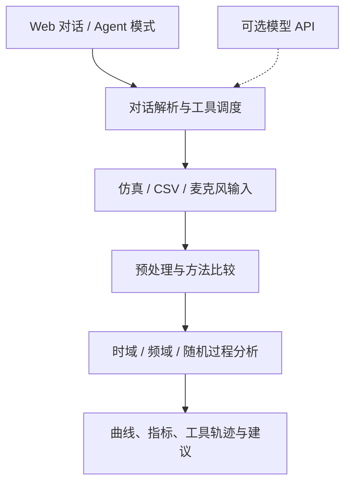
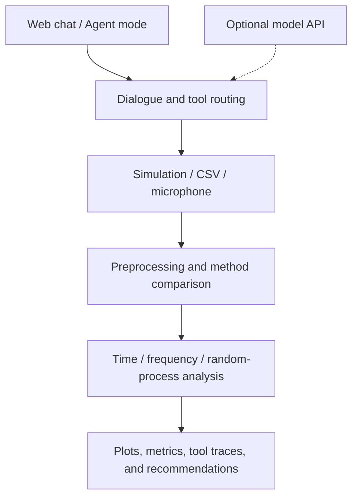

<div align="center">

# 🌊 Random Signal Agent · 谛听

[](https://github.com/PatrickStar-cmd/random-signal-agent/releases/latest)
[](RELEASE.md)
[](https://github.com/PatrickStar-cmd/random-signal-agent/actions/workflows/validate-deployment.yml)
[](LICENSE)

</div>

<details name="readme-language">
<summary><strong>简体中文</strong></summary>

<div align="justify">

**通过对话完成信号仿真、滤波与分析。**

谛听将随机信号课程中的实验串联成可复现的分析流程：生成带噪信号、比较滤波方法、查看时频特征，并在同一个 Web 界面中追踪工具调用。

项目面向 **UESTC 随机信号课程**。本地工具链无需模型 API Key 即可运行，也可接入兼容 Chat Completions 的服务，增强对话能力。

[🌐 实验预览](https://patrickstar-cmd.github.io/random-signal-agent/) · [📦 下载 v0.1.0](https://github.com/PatrickStar-cmd/random-signal-agent/releases/tag/v0.1.0) · [📘 安装指南](RELEASE.md)

## 🧭 快速导航

| 开始使用 | 了解项目 |
| --- | --- |
| [✨ 核心功能](#zh-features) | [🏗️ 工作流程](#zh-workflow) |
| [🎬 界面展示](#zh-interface) | [⚙️ 配置说明](#zh-configuration) |
| [🚀 快速开始](#zh-quick-start) | [📊 实验结果](#zh-results) |
| [🧪 第一个实验](#zh-first-experiment) | [🔧 常见问题](#zh-troubleshooting) |
| [📚 项目文档](#zh-documentation) | [🤝 参与改进](#zh-contributing) |

<a id="zh-features"></a>

## ✨ 核心功能

| 功能 | 可以完成的实验 |
| --- | --- |
| 🎲 可复现仿真 | 设置采样率、时长、主频、噪声和随机种子，生成同一组样本。 |
| 🧹 六种预处理方法 | 比较鲁棒滑动平均、中值、指数平滑、FFT 低通、混合增强与卡尔曼滤波。 |
| 📈 时频域分析 | 查看统计指标、FFT 峰值、相关性与频谱特征。 |
| 🔬 随机过程分析 | 分析 AR 模型、Welch 功率谱与残差。 |
| 🤖 Agent 模式 | 自动比较方法与参数，查看工具调用轨迹和控制建议。 |
| 🎙️ 多种输入 | 分析仿真信号、CSV/TXT 样本或浏览器麦克风音频，下载处理后的音频。 |

<a id="zh-interface"></a>

## 🎬 界面展示


<details>
<summary><strong>查看 Agent 模式操作演示</strong></summary>

开启 **Agent 模式**，输入采集指令，即可查看预处理方法比较和分析结果。


</details>

<a id="zh-quick-start"></a>

## 🚀 快速开始

使用 **Python 3.12** 或 **Docker Compose v2**。v0.1.0 部署包已通过 Windows、Linux 全新环境安装及 Linux Docker 部署验证。

### 1. 获取项目

下载并解压[部署 ZIP](https://github.com/PatrickStar-cmd/random-signal-agent/releases/download/v0.1.0/random-signal-agent-v0.1.0-deploy.zip)，在解压目录中的 `工程文件/代码` 打开终端。

也可以克隆仓库：

```bash
git clone https://github.com/PatrickStar-cmd/random-signal-agent.git
cd "random-signal-agent/工程文件/代码"
```

### 2. 安装并启动

**Windows PowerShell**：确认使用 Python 3.12。

```powershell
python -m venv .venv
.\.venv\Scripts\python.exe -m pip install -r requirements-repro.txt
.\.venv\Scripts\python.exe server.py --host 127.0.0.1 --port 8000
```

**Linux / macOS**：

```bash
python3.12 -m venv .venv
.venv/bin/python -m pip install -r requirements-repro.txt
.venv/bin/python server.py --host 127.0.0.1 --port 8000
```

<details>
<summary><strong>使用 Docker 启动</strong></summary>

在同一个 `工程文件/代码` 目录执行：

```bash
cp .env.example .env
docker compose up -d --build --wait --wait-timeout 120
```

Windows 将第一条命令替换为 `Copy-Item .env.example .env`。上传文件和生成结果保存在本地目录中；使用 `docker compose logs --tail 100` 查看日志，使用 `docker compose down` 停止服务。

</details>

### 3. 打开应用

访问 **<http://127.0.0.1:8000>**。无需配置外部模型，即可使用仿真、滤波和分析功能。

[在线预览](https://patrickstar-cmd.github.io/random-signal-agent/) 包含已保存的实验结果与界面截图；交互实验需要运行 Python 后端。

<a id="zh-first-experiment"></a>

## 🧪 第一个实验

1. 在对话栏输入采集指令：

   > 采集一段 8 秒、采样率 200Hz、主频 8Hz 的正弦信号加高斯噪声，随机种子 42

2. 继续输入预处理与分析指令：

   > 使用滑动平均预处理并分析时域和频域特征

3. 查看曲线和指标。也可以在采集前开启 **Agent 模式**，自动比较预处理方法。

保持相同参数和随机种子，可重复生成同一组仿真样本。文件输入支持单列采样值或“时间、采样值”双列数据，格式见[实验说明](docs/README.md)。

<a id="zh-workflow"></a>

## 🏗️ 工作流程



| 组件 | 职责 |
| --- | --- |
| `web/chat.html` + `server.py` | Web 界面、上传、HTTP 接口与流式响应。 |
| `src/dialogue_agent.py` | 解析任务并调度信号工具。 |
| `src/acquisition.py` | 接收仿真信号、上传样本与音频。 |
| `src/preprocessing.py` | 信号滤波与候选方法比较。 |
| `src/analysis.py` + `src/advanced_analysis.py` | 提取时域、频域和随机过程特征。 |
| `src/llm_client.py` | 连接可选的 Chat Completions 兼容服务。 |

以上组件路径均相对于 `工程文件/代码`。

<a id="zh-configuration"></a>

## ⚙️ 配置说明

快速开始命令使用本地工具链。需要接入外部模型时，将 `config/server.env.example` 复制为 `config/server.env`，填写模型地址、名称与密钥。

| 配置项 | 用途 |
| --- | --- |
| `RS_AGENT_HOST` / `RS_AGENT_PORT` | 服务绑定地址与端口；仅本地使用时设置为 `127.0.0.1`。 |
| `RS_AGENT_LLM_BASE_URL` | 模型 API Base URL，例如 `https://your-provider.example.com/v1`。 |
| `RS_AGENT_LLM_MODEL` | 服务商提供的模型名称。 |
| `RS_AGENT_LLM_API_KEY` | 自己的模型 API Key。 |
| `RS_AGENT_LLM_TIMEOUT` | 模型请求超时秒数，默认 `45`。 |
| `RS_AGENT_LOG_FILE` | 启动脚本的日志路径，默认 `logs/server/server.log`。 |

激活虚拟环境后，Windows 使用 `scripts/start_server.ps1`，Linux/macOS 使用 `bash scripts/start_server.sh`，即可加载该配置文件。直接运行 `server.py` 不会加载 `config/server.env`。

Docker Compose 读取代码目录下的 `.env`。Docker 参数、HTTPS 部署与服务管理见[部署说明](工程文件/代码/DEPLOY.md)。

<a id="zh-results"></a>

## 📊 可复现实验示例

已保存的展示实验采用随机过程与混合噪声：采样率 **200 Hz**，时长 **8 秒**，共 **1600 点**，主频 **8 Hz**，随机种子 **42**。预处理使用 7 点窗口的鲁棒滑动平均。

| 指标 | 结果 |
| --- | ---: |
| 检测主频 | 8.000 Hz |
| 原始 SNR | 2.859 dB |
| 处理后 SNR | 4.781 dB |
| SNR 提升 | 1.922 dB |

以上数值对应这组已保存的实验，其他信号或滤波参数会得到不同结果。

[CSV 样例](docs/data/sample.csv) · [分析结果](docs/data/result.json) · [实验配置](工程文件/代码/config/showcase.json) · [复现步骤](docs/README.md)

<details>
<summary><strong>检查部署是否正常</strong></summary>

保持应用运行，在另一终端进入 `工程文件/代码`，使用相同的 Python 环境执行：

```powershell
# Windows
.\.venv\Scripts\python.exe scripts/smoke_deployment.py --base-url http://127.0.0.1:8000
```

```bash
# Linux / macOS
.venv/bin/python scripts/smoke_deployment.py --base-url http://127.0.0.1:8000
```

检查覆盖健康接口、页面资源、Agent 模式、流式响应、CSV 上传和合成音频下载，结果写入 `logs/deployment/latest.log`。Release 附件还包含 `SHA256SUMS.txt` 和 `verification.json`。

</details>

<a id="zh-troubleshooting"></a>

## 🔧 常见问题

| 问题 | 处理方式 |
| --- | --- |
| 为什么在线预览不能运行新实验？ | GitHub Pages 提供已保存的展示内容。运行本地后端或使用 Docker 部署，即可交互实验。 |
| 必须配置 API Key 吗？ | 本地信号工具无需密钥；模型辅助对话属于可选功能。 |
| 为什么 Python 3.13 及以上版本无法启动？ | 当前后端依赖这些版本已移除的 `cgi`。使用 Python 3.12 并安装 `requirements-repro.txt`。 |
| Windows 无法激活虚拟环境怎么办？ | 快速开始命令直接调用 `.venv\Scripts\python.exe`，无需激活。 |
| 麦克风无法使用怎么办？ | 通过 localhost 或 HTTPS 访问应用，并在浏览器中允许麦克风权限。 |
| 为什么上传信号没有 SNR 数值？ | 基于参考信号的 SNR 需要干净信号；上传样本与麦克风音频不包含该参考。 |
| 8000 端口被占用怎么办？ | 启动时改用 `--port 8001`，访问 `http://127.0.0.1:8001`，并同步修改部署检查的 URL。 |

<a id="zh-documentation"></a>

## 📚 项目文档

| 文档 | 内容 |
| --- | --- |
| [安装与发布说明](RELEASE.md) | 部署 ZIP、各系统启动命令与校验方式。 |
| [实验说明](docs/README.md) | 展示数据、参数、文件格式与复现步骤。 |
| [代码概览](工程文件/代码/README.md) | 模块结构与模型配置。 |
| [运行与配置](工程文件/代码/docs/exec.md) | 执行命令、配置参数与日志。 |
| [功能与验证](工程文件/代码/docs/review.md) | 实现情况、验证记录与当前限制。 |
| [算法原理](工程文件/代码/docs/principle.md) | 信号处理与分析方法。 |
| [部署说明](工程文件/代码/DEPLOY.md) | Docker、HTTPS、systemd 与健康检查。 |
| [更新日志](CHANGELOG.md) | 版本变更。 |

仓库也包含[原始 PDF 配置教程](工程文件/配置文档/随机信号智能体配置教程.pdf)。

<a id="zh-contributing"></a>

## 🤝 参与改进

欢迎通过 Issue 或 Pull Request 提交问题修复、信号处理方法、实验样例和文档改进。报告问题时请提供 Python 版本、输入参数、复现步骤及相关日志；改进算法时请附上可复现信号与处理前后的对比。

[提交问题](https://github.com/PatrickStar-cmd/random-signal-agent/issues) · [查看 Pull Requests](https://github.com/PatrickStar-cmd/random-signal-agent/pulls)

## 📄 许可证

本项目采用 [MIT License](LICENSE)。使用、修改与分发时请保留许可证和版权声明；第三方依赖及素材遵循其各自许可。

</div>

</details>

<details name="readme-language" open>
<summary><strong>English</strong></summary>

<div align="left">

**Signal simulation, filtering, and analysis — through conversation.**

Diting turns Random Signals coursework into reproducible experiments. Generate a noisy signal, compare filters, inspect its time and frequency features, and follow each tool call in one Web interface.

Built for the Random Signals course at **UESTC**. The local toolchain works without a model API key; an optional Chat Completions-compatible service adds model-assisted dialogue.

[🌐 Experiment preview](https://patrickstar-cmd.github.io/random-signal-agent/) · [📦 Download v0.1.0](https://github.com/PatrickStar-cmd/random-signal-agent/releases/tag/v0.1.0) · [📘 Installation guide](RELEASE.md)

## 🧭 Explore

| Get started | Learn more |
| --- | --- |
| [✨ Features](#en-features) | [🏗️ How it works](#en-workflow) |
| [🎬 Interface](#en-interface) | [⚙️ Configuration](#en-configuration) |
| [🚀 Quick start](#en-quick-start) | [📊 Example results](#en-results) |
| [🧪 First experiment](#en-first-experiment) | [🔧 Troubleshooting](#en-troubleshooting) |
| [📚 Documentation](#en-documentation) | [🤝 Contributing](#en-contributing) |

<a id="en-features"></a>

## ✨ Features

| Capability | What you can do |
| --- | --- |
| 🎲 Reproducible simulation | Set sample rate, duration, frequency, noise, and random seed. |
| 🧹 Six preprocessing methods | Compare robust moving average, median, exponential smoothing, FFT low-pass, hybrid, and Kalman filtering. |
| 📈 Time and frequency analysis | Inspect statistics, FFT peaks, correlations, and spectral features. |
| 🔬 Random-process analysis | Explore AR models, Welch power spectra, and residuals. |
| 🤖 Agent mode | Compare methods and parameters automatically, inspect tool traces, and review recommendations. |
| 🎙️ Multiple inputs | Analyze simulated signals, CSV/TXT samples, or browser microphone audio; download processed audio. |

<a id="en-interface"></a>

## 🎬 Interface


<details>
<summary><strong>Watch an Agent mode experiment</strong></summary>

Enable **Agent mode**, enter an acquisition command, and follow the preprocessing comparisons and analysis results.


</details>

<a id="en-quick-start"></a>

## 🚀 Quick start

Use **Python 3.12** or **Docker Compose v2**. The v0.1.0 deployment package has been verified on Windows and Linux, including Docker on Linux.

### 1. Get the project

Download and extract the [deployment ZIP](https://github.com/PatrickStar-cmd/random-signal-agent/releases/download/v0.1.0/random-signal-agent-v0.1.0-deploy.zip), then open a terminal in `工程文件/代码` inside the extracted folder.

Or clone the repository:

```bash
git clone https://github.com/PatrickStar-cmd/random-signal-agent.git
cd "random-signal-agent/工程文件/代码"
```

### 2. Install and start

**Windows PowerShell** — use a Python 3.12 installation:

```powershell
python -m venv .venv
.\.venv\Scripts\python.exe -m pip install -r requirements-repro.txt
.\.venv\Scripts\python.exe server.py --host 127.0.0.1 --port 8000
```

**Linux / macOS**

```bash
python3.12 -m venv .venv
.venv/bin/python -m pip install -r requirements-repro.txt
.venv/bin/python server.py --host 127.0.0.1 --port 8000
```

<details>
<summary><strong>Run with Docker instead</strong></summary>

From the same `工程文件/代码` directory:

```bash
cp .env.example .env
docker compose up -d --build --wait --wait-timeout 120
```

On Windows, replace the first command with `Copy-Item .env.example .env`. Uploads and generated outputs persist in local folders. Use `docker compose logs --tail 100` to inspect the service and `docker compose down` to stop it.

</details>

### 3. Open the application

Visit **<http://127.0.0.1:8000>**. Simulation, filtering, and analysis are available without configuring an external model.

The [online preview](https://patrickstar-cmd.github.io/random-signal-agent/) shows the saved experiment and interface captures. Interactive experiments run with the Python backend.

<a id="en-first-experiment"></a>

## 🧪 Your first experiment

1. Enter this acquisition command in the chat. The example uses Chinese, as supported by the local command parser:

   > 采集一段 8 秒、采样率 200Hz、主频 8Hz 的正弦信号加高斯噪声，随机种子 42

   This creates an 8-second sine signal with Gaussian noise at 200 Hz, with an 8 Hz target frequency and seed 42.

2. Ask for preprocessing and analysis:

   > 使用滑动平均预处理并分析时域和频域特征

3. Inspect the curves and metrics. Enable **Agent mode** before acquisition to compare preprocessing methods automatically.

Keep the same parameters and random seed to reproduce the same simulated samples. For file inputs, use a single column of sample values or two columns of time and values; see the [data guide](docs/README.en.md).

<a id="en-workflow"></a>

## 🏗️ How it works



| Component | Responsibility |
| --- | --- |
| `web/chat.html` + `server.py` | Web interface, uploads, HTTP endpoints, and streamed responses. |
| `src/dialogue_agent.py` | Interpret tasks and coordinate the signal tools. |
| `src/acquisition.py` | Acquire simulated signals, uploaded samples, and audio. |
| `src/preprocessing.py` | Filter signals and compare candidate methods. |
| `src/analysis.py` + `src/advanced_analysis.py` | Calculate time, frequency, and random-process features. |
| `src/llm_client.py` | Connect to an optional Chat Completions-compatible service. |

All component paths are relative to `工程文件/代码`.

<a id="en-configuration"></a>

## ⚙️ Configuration

The quick-start commands use the local toolchain. To connect an external model, copy `config/server.env.example` to `config/server.env` and fill in your endpoint, model, and key.

| Setting | Purpose |
| --- | --- |
| `RS_AGENT_HOST` / `RS_AGENT_PORT` | Server bind address and port; use `127.0.0.1` for local access. |
| `RS_AGENT_LLM_BASE_URL` | Model API base URL, such as `https://your-provider.example.com/v1`. |
| `RS_AGENT_LLM_MODEL` | Model identifier accepted by your provider. |
| `RS_AGENT_LLM_API_KEY` | Your provider's API key. |
| `RS_AGENT_LLM_TIMEOUT` | Model request timeout in seconds; default: `45`. |
| `RS_AGENT_LOG_FILE` | Startup-script log path; default: `logs/server/server.log`. |

After activating the virtual environment, use `scripts/start_server.ps1` on Windows or `bash scripts/start_server.sh` on Linux/macOS to load this file. Directly running `server.py` does not load `config/server.env`.

Docker Compose reads `.env` in the code directory. See the [deployment guide](工程文件/代码/DEPLOY.md) for Docker settings, HTTPS hosting, and service management.

<a id="en-results"></a>

## 📊 Reproducible example

The saved showcase uses a random process with mixed noise: **200 Hz**, **8 seconds**, **1,600 samples**, an **8 Hz** target frequency, and **seed 42**. A robust moving average uses a 7-sample window.

| Metric | Result |
| --- | ---: |
| Detected dominant frequency | 8.000 Hz |
| Original SNR | 2.859 dB |
| Processed SNR | 4.781 dB |
| SNR improvement | 1.922 dB |

Results depend on the input signal and filter parameters.

[Sample CSV](docs/data/sample.csv) · [Analysis results](docs/data/result.json) · [Experiment configuration](工程文件/代码/config/showcase.json) · [Reproduction guide](docs/README.en.md)

<details>
<summary><strong>Check your deployment</strong></summary>

With the application running, open another terminal in `工程文件/代码` and use the same Python environment:

```powershell
# Windows
.\.venv\Scripts\python.exe scripts/smoke_deployment.py --base-url http://127.0.0.1:8000
```

```bash
# Linux / macOS
.venv/bin/python scripts/smoke_deployment.py --base-url http://127.0.0.1:8000
```

The check covers health, Web assets, Agent mode, streaming, CSV upload, and synthetic audio download. Its result is written to `logs/deployment/latest.log`. Release assets also include `SHA256SUMS.txt` and `verification.json`.

</details>

<a id="en-troubleshooting"></a>

## 🔧 Troubleshooting

| Question | Answer |
| --- | --- |
| Why does the online preview not run new experiments? | GitHub Pages serves the saved showcase. Start the backend locally or deploy it with Docker for interactive use. |
| Do I need an API key? | The local signal tools do not require one. Model-assisted dialogue is optional. |
| Why does Python 3.13+ fail to start the server? | The backend uses `cgi`, which is unavailable in those versions. Use Python 3.12 with `requirements-repro.txt`. |
| Why can I not activate the virtual environment on Windows? | The quick-start commands call `.venv\Scripts\python.exe` directly and do not require activation. |
| Why is the microphone unavailable? | Open the app on localhost or HTTPS and allow microphone access in the browser. |
| Why does my uploaded signal have no SNR value? | Reference-based SNR requires a clean signal. Uploaded samples and microphone audio do not provide that reference. |
| What if port 8000 is occupied? | Start with `--port 8001`, then open `http://127.0.0.1:8001`; update the smoke-check URL too. |

<a id="en-documentation"></a>

## 📚 Documentation

| Guide | Contents |
| --- | --- |
| [Installation & release](RELEASE.md) | Deployment ZIP, platform commands, and checksums. |
| [Experiment guide](docs/README.en.md) | Saved data, parameters, file formats, and reproduction. |
| [Code overview](工程文件/代码/README.md) | Modules and model configuration. |
| [Running & configuration](工程文件/代码/docs/exec.md) | Commands, settings, and logs. |
| [Features & validation](工程文件/代码/docs/review.md) | Implemented capabilities, checks, and current limits. |
| [Algorithm principles](工程文件/代码/docs/principle.md) | Signal-processing methods and analysis. |
| [Deployment](工程文件/代码/DEPLOY.md) | Docker, HTTPS, systemd, and health checks. |
| [Changelog](CHANGELOG.md) | Release history. |

The code and algorithm guides are in Chinese. The [original PDF setup guide](工程文件/配置文档/随机信号智能体配置教程.pdf) is also included.

<a id="en-contributing"></a>

## 🤝 Contributing

Issues and pull requests are welcome for bug fixes, signal-processing methods, experiment examples, and documentation. For a bug report, include your Python version, input parameters, steps to reproduce, and relevant logs. For an algorithm change, include a reproducible signal and a before/after comparison.

[Open an issue](https://github.com/PatrickStar-cmd/random-signal-agent/issues) · [View pull requests](https://github.com/PatrickStar-cmd/random-signal-agent/pulls)

## 📄 License

Licensed under the [MIT License](LICENSE). Retain the license and copyright notice when using, modifying, or distributing the project. Third-party dependencies and assets retain their respective licenses.

</div>

</details>
