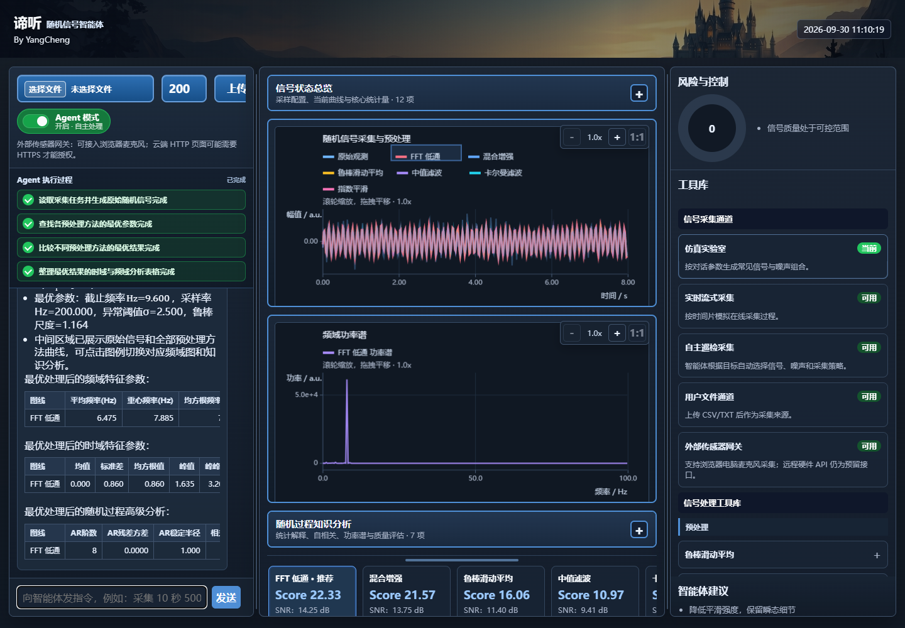

# Random Signal Agent · 随机信号智能体

<details name="readme-language">
<summary><strong>English</strong></summary>

**A signal analysis agent for the Random Signals course at UESTC**

Diting brings signal simulation, filter comparison, time and frequency analysis, and random-process analysis into a conversational Web interface. It also supports CSV/TXT files and microphone audio.

The local toolchain runs without an external model. A Chat Completions-compatible model service can be connected for additional capabilities.

[Live demo](https://patrickstar-cmd.github.io/random-signal-agent/) · [Experiment data](docs/README.en.md) · [MIT License](LICENSE)

## Features



- **Experiments through conversation**: set the sample rate, duration, target frequency, and random seed to generate reproducible signals.
- **Automatic filter comparison**: robust moving average, median filtering, exponential smoothing, FFT low-pass filtering, hybrid filtering, and Kalman filtering, with curves and parameter comparisons.
- **Signal and random-process analysis**: time-domain statistics, FFT, correlation, AR models, Welch power spectra, and residual analysis.
- **Multiple inputs**: simulated signals, CSV/TXT files, and browser microphone audio, with analysis metrics and control recommendations.

Enable Agent mode and enter an acquisition command to compare preprocessing methods and view the results.


## Example experiment

Seed 42, a sample rate of 200 Hz, an 8-second duration, an 8 Hz target frequency, and 1,600 samples. The input combines a random process with mixed noise; preprocessing uses a robust moving average with a 7-sample window.

| Metric | Result |
| --- | ---: |
| Detected dominant frequency | 8.000 Hz |
| Original SNR | 2.859 dB |
| Processed SNR | 4.781 dB |
| SNR improvement | 1.922 dB |

[Sample CSV](docs/data/sample.csv) · [Analysis results](docs/data/result.json) · [Experiment configuration](工程文件/代码/config/showcase.json)

See the [experiment guide](docs/README.en.md) for parameters, file formats, and reproduction steps.

## Getting started

Requirements: **Python 3.10–3.12**, preferably 3.12. The backend uses `cgi` and does not currently support Python 3.13 or later.

```bash
git clone https://github.com/PatrickStar-cmd/random-signal-agent.git
cd random-signal-agent
cd "工程文件/代码"
python -m venv .venv
```

Windows PowerShell:

```powershell
.\.venv\Scripts\Activate.ps1
python -m pip install -r requirements-repro.txt
python server.py --host 127.0.0.1 --port 8000
```

Linux/macOS (use Python 3.12, or create the environment with `python3.12`):

```bash
source .venv/bin/activate
python -m pip install -r requirements-repro.txt
python server.py --host 127.0.0.1 --port 8000
```

### Start an experiment

Open <http://127.0.0.1:8000> and enter this example command in Chinese:

> 采集一段 8 秒、采样率 200Hz、主频 8Hz 的正弦信号加高斯噪声，随机种子 42

This generates an 8-second sine signal with Gaussian noise at a sample rate of 200 Hz and a target frequency of 8 Hz, using seed 42.

Then enter “使用滑动平均预处理并分析时域和频域特征” to apply moving-average preprocessing and analyze time and frequency features, or enable Agent mode to compare methods automatically. The same parameters and seed reproduce the same samples.

## Documentation (Chinese)

- [Code and configuration](工程文件/代码/README.md)
- [Running and configuring the project](工程文件/代码/docs/exec.md)
- [Features and validation records](工程文件/代码/docs/review.md)
- [Algorithm principles](工程文件/代码/docs/principle.md)
- [Deployment](工程文件/代码/DEPLOY.md)
- [Original PDF setup guide](工程文件/配置文档/随机信号智能体配置教程.pdf)

## License

This project is licensed under the [MIT License](LICENSE). Retain the license and copyright notice when using, modifying, or distributing it. Third-party dependencies and assets retain their respective licenses.

</details>

<details name="readme-language" open>
<summary><strong>简体中文</strong></summary>

**UESTC 随机信号课程智能体项目**

谛听是面向随机信号课程的信号分析智能体。通过对话生成仿真信号，比较滤波方法，分析时频特征与随机过程，也支持 CSV/TXT 文件和麦克风音频。

本地工具链无需外部模型即可运行，也可接入兼容 Chat Completions 的模型服务。

[在线演示](https://patrickstar-cmd.github.io/random-signal-agent/) · [实验数据](docs/README.md) · [MIT 许可证](LICENSE)

## 功能


- **自然语言实验**：指定采样率、时长、主频与随机种子，生成可复现的仿真信号。
- **自动比较预处理**：鲁棒滑动平均、中值、指数平滑、FFT 低通、混合增强和卡尔曼滤波，展示曲线与参数比较。
- **时频与随机过程分析**：时域统计、FFT、相关性、AR 模型、Welch 功率谱与残差分析。
- **多种输入**：仿真、CSV/TXT 文件、浏览器麦克风；可查看分析指标和控制建议。

开启 Agent 模式后，输入采集指令即可自动比较预处理方法并查看分析结果。


## 实验示例

固定种子 42，采样率 200 Hz，时长 8 秒，主频 8 Hz，共 1600 点。使用随机过程与混合噪声，采用 7 点窗口的鲁棒滑动平均。

| 指标 | 结果 |
| --- | ---: |
| 检测主频 | 8.000 Hz |
| 原始 SNR | 2.859 dB |
| 处理后 SNR | 4.781 dB |
| SNR 提升 | 1.922 dB |

[CSV 样例](docs/data/sample.csv) · [分析结果](docs/data/result.json) · [实验配置](工程文件/代码/config/showcase.json)

实验参数、数据格式与复现方法见[实验说明](docs/README.md)。

## 从零复现

环境：**Python 3.10–3.12**，推荐 3.12。后端使用 `cgi`，暂不支持 Python 3.13 及以上版本。

```bash
git clone https://github.com/PatrickStar-cmd/random-signal-agent.git
cd random-signal-agent
cd "工程文件/代码"
python -m venv .venv
```

Windows PowerShell：

```powershell
.\.venv\Scripts\Activate.ps1
python -m pip install -r requirements-repro.txt
python server.py --host 127.0.0.1 --port 8000
```

Linux/macOS（确认 `python` 指向 Python 3.12，或创建环境时改用 `python3.12`）：

```bash
source .venv/bin/activate
python -m pip install -r requirements-repro.txt
python server.py --host 127.0.0.1 --port 8000
```
### 开始一项实验

打开 <http://127.0.0.1:8000>，在对话栏输入：

> 采集一段 8 秒、采样率 200Hz、主频 8Hz 的正弦信号加高斯噪声，随机种子 42

继续输入“使用滑动平均预处理并分析时域和频域特征”，或开启 Agent 模式自动比较预处理方法。使用相同参数和随机种子可重复生成同一组样本。

## 文档

- [代码与配置](工程文件/代码/README.md)
- [运行与配置](工程文件/代码/docs/exec.md)
- [功能与验证记录](工程文件/代码/docs/review.md)
- [算法原理](工程文件/代码/docs/principle.md)
- [部署说明](工程文件/代码/DEPLOY.md)
- [原始 PDF 配置教程](工程文件/配置文档/随机信号智能体配置教程.pdf)

## 许可证

本项目采用 [MIT License](LICENSE)。使用、修改与分发时请保留许可证和版权声明；第三方依赖及素材遵循其各自许可。

</details>
